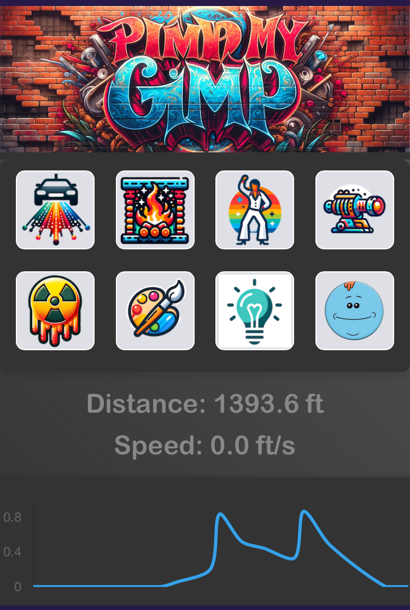

# Pimp my Gimp

>_"When Life Gives You Lemons, You Paint That Shit Gold"_
> \- Atmosphere

Enhance your mobility experience with "Pimp My Gimp," a makeover for your mobility assistive device using a Raspberry Pi and Python. Features include battery-operated programmable LED underlighting, speakers, and a real-time speedometer.

 


## Features

- Mobile-friendly web interface.
- Customizable LED underlighting.
- Integrated odometer and speedometer (optional).
- Interactive sound effects (optional).
- Completely battery-operated system.

## Getting Started

### Prerequisites

Install docker on your Raspberry Pi:
```shell
sudo apt update
sudo apt install -y software-properties-common
curl -fsSL https://download.docker.com/linux/ubuntu/gpg | sudo apt-key add -
sudo apt-add-repository "deb [arch=armhf] https://download.docker.com/linux/ubuntu $(lsb_release -cs) stable"
sudo apt update
sudo apt install -y docker-ce docker-ce-cli containerd.io docker-compose
sudo newgrp docker
sudo usermod -aG docker ${USER}
```


### Deployment

Deploy the application with the following Docker command:

```shell
docker run --name pimp-my-gimp --privileged -p 80:80/tcp elgeeko/pimp-my-gimp
```

## Parts

### Raspberry Pi

- Mobility Device (example): [KneeRover Knee Scooter](https://www.amazon.com/dp/B01J4AMXD8)
- Raspberry Pi: [Raspberry Pi 4B](https://www.raspberrypi.com/products/raspberry-pi-4-model-b/)
- Case: [Miuzei Raspberry Pi 4B Case](https://a.co/d/8ELukua)
- Battery: [Talentcell 22400mAh 82.88Wh lithium ion battery PB240A1](https://www.amazon.com/dp/B078T7M9HZ)
- Benchtop power (for prototyping): [ALITOVE 5V 10A Power Supply](https://www.amazon.com/dp/B0852HL336)
- USB pigtail: [USB 2.0 Male Bare Cable Pigtail](https://www.amazon.com/dp/B09ZQNJ2DJ)

### LED Light Strip
- LED Strip Light: [Adafruit NeoPixel 332 LED-per-Meter Silicone Bead LED Strip](https://www.adafruit.com/product/4865)
- Connector: [3-pin JST SM Plug](https://www.adafruit.com/product/1663)

### Speed Measurement (optional)

- Magnet: [Neodymium magnet 0.125" cube](https://www.sparkfun.com/products/8644) x 4
- Sensor: [AN1815 Hall Effect Sensor](https://www.sparkfun.com/products/14709)

### Audio Output (optional)

- DAC: [Cubilux USB to 3.5mm Audio Adapter](https://a.co/d/5YjWS0N)
- Amplifier: [SparkFun Qwiic Speaker Amp](https://www.sparkfun.com/products/20690)
- Speakers: [Sparkfun Thin Speaker - 4 Ohm, 2.5W, 28mm](https://www.sparkfun.com/products/21311) x 2
- Wiring: [3.5mm Audio Cable - Male to Male](https://www.amazon.com/3-5mm-CGTime-Plated-Auxiliary-Stereo/dp/B074QHNY5Q)


## Mount Hardware


_Pimped-out Mobility scooter system_


_Electronics mounting_


_Underseat mouting and wiring_


_LED track lighting mounted using double-sided tape_


_Speedometer mounting_


_Mounting of magnets on moving axle and Hall Effect sensor. Ensure the Hall Effect sensor is proximate to magnets as they pass by without contacting them._

## Wiring

### Connect the Raspberry Pi


### Connect the LED Light Strip


### Connect the Hall Effect Sensor


### Connect the Speakers


## Documentation and References

### Software Libraries

- [Adafruit NeoPixel UberGuide](https://learn.adafruit.com/adafruit-neopixel-uberguide)
- [Adafruit CircuitPython NeoPixel Library](https://github.com/adafruit/Adafruit_CircuitPython_NeoPixel)

### Tutorials

- [The Raspi-Config Tool](https://www.raspberrypi.com/documentation/computers/configuration.html)

## Contributors

- [elgeeko1](https://github.com/elgeeko1)
- [slkollasch](https://github.com/slkollasch)

## License

This project is licensed under the MIT License - see the [LICENSE.md](LICENSE.md) file for details.